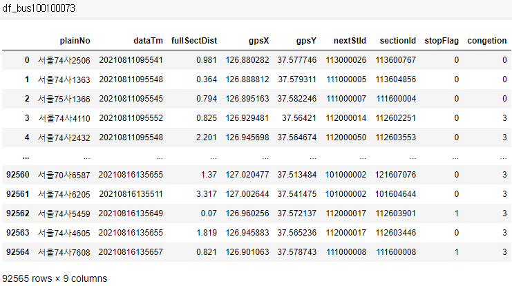
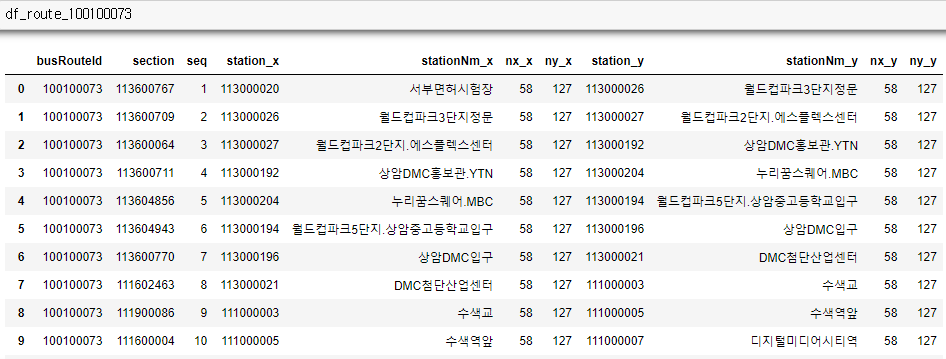
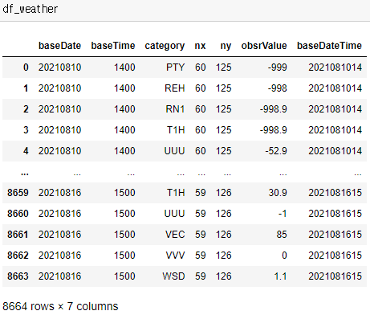
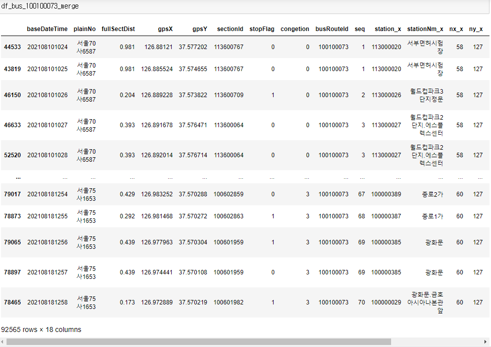

# 과정

* 수집

  * 버스, 날씨 데이터 수집

    * 서울특별시 노선정보조회 서비스

      * https://www.data.go.kr/tcs/dss/selectApiDataDetailView.do?publicDataPk=15000193

      * 노선 정류장별 정보

        ```xml
        <itemList>
            <arsId>09289</arsId> 정류소번호
            <beginTm>04:30</beginTm>
            <busRouteId>100100023</busRouteId>
            <busRouteNm>144</busRouteNm> 노선명
            <direction>교대</direction> 진행방향
            <gpsX>127.012021</gpsX> 노선유형	(3:간선, 4:지선, 5:순환, 6:광역)
            <gpsY>37.662987</gpsY>
            <lastTm>23:40</lastTm>
            <posX>201060.51127293977</posX>
            <posY>462597.8949021329</posY>
            <routeType>3</routeType>
            <sectSpd>0</sectSpd> 구간속도
            <section>0</section> 구간ID
            <seq>1</seq>
            <station>108000194</station>
            <stationNm>우이동차고지기점</stationNm>
            <stationNo>09289</stationNo> 정류소고유번호
            <transYn>N</transYn>
            <fullSectDist>0</fullSectDist> 구간거리
            <trnstnid>121000031</trnstnid>
        </itemList>
        ```

    * 서울특별시 버스위치정보조회 서비스

      * https://www.data.go.kr/tcs/dss/selectApiDataDetailView.do?publicDataPk=15000332

      * 같은 노선ID에 해당되는 모든 버스의 위치 알려줌

      * 제공시간은 모든 버스 제각각(동일한 요청에도)

        ```xml
        <itemList>
            <busType>1</busType>
            <congetion>0</congetion>
            <dataTm>20210806111845</dataTm> 제공시간
            <fullSectDist>0.483</fullSectDist> 정류소간 거리
            <gpsX>127.013813</gpsX> WGS84좌표
            <gpsY>37.649185</gpsY> WGS84좌표
            <isFullFlag>0</isFullFlag> 만차여부
            <islastyn>0</islastyn> 막차여부
            <isrunyn>1</isrunyn> 해당차량 운행여부
            <lastStTm>11769</lastStTm> 종점도착소요시간
            <lastStnId>108000020</lastStnId>
            <nextStId>108000070</nextStId> 다음정류소아이디
            <nextStTm>575</nextStTm> 다음정류소도착소요시간
            <plainNo>서울74사3203</plainNo>
            <posX>201218.82989392456</posX> GRS80
            <posY>461066.1970208208</posY> GRS80
            <rtDist>47.2</rtDist> 노선옵셋거리
            <sectDist>0.045</sectDist> 구간옵셋거리
            <sectOrd>7</sectOrd> 구간순번
            <sectionId>108601759</sectionId> 구간ID
            <stopFlag>1</stopFlag> 정류소도착여부, 도착
            <trnstnid>121000031</trnstnid> 회차지 정류소ID
            <vehId>108026374</vehId> 버스ID
        </itemList>
        ```

    * 기상청 단기예보 조회서비스

      * https://www.data.go.kr/tcs/dss/selectApiDataDetailView.do?publicDataPk=15084084

      * 초단기실황조회

        ```xml
        <item>
            <baseDate>20210806</baseDate>
            <baseTime>0600</baseTime> 발표시각
            <category>PTY</category> 자료구분코드(기온, 1시간 강수량, 습도, 강수형태, 풍향, 풍속 등)
            <nx>55</nx> 예보지점 x좌표
            <ny>127</ny> 예보지점 y좌표
            <obsrValue>0</obsrValue> 자료구분코드의 값(PTY는 강수형태, 0은 없음)
        </item>
        ```

    * 데이터 수집 방법

      * 서울특별시 버스위치정보조회 서비스, 기상청 단기예보 조회서비스에 요청할 때마다 가장 최근에 갱신된 정보를 제공
      * 버스위치의 경우 인당 트래픽 제한으로 인해 한 노선에 대해서 1분 간격으로 데이터 요청
      * 기상실황의 경우 1시간마다 새로운 정보가 갱신되어 1시간 간격으로 데이터 요청
      * 쿼츠 크론을 이용해 리눅스에서 특정 시간 간격(1분 or 1시간)으로 api에 request를 보냄
      * 데이터를 새로 수집할 때마다 pyspark를 이용해 전처리

    * 쿼츠 크론

      * 쿼츠 크론은 주기적으로 명령을 실행할 수 있게 하는 프로그램

        * `crontab -e`로 등록 가능

        ```shell
        # bus, weather crawling
        * 5-19 * * * bash -i ~/crawl_bus.sh
        20 5-19 * * * bash -i ~/crawl_weather.sh
        ```

      * 쿼츠 크론으로 crawl_bus.sh, crawl_weather 파일 실행

        * 굳이 crontab에서 바로 `python crawl_bus.py`를 실행하지 않은 이유
          * conda 환경에서 실행하려면 인터렉티브 모드(bash -i)로 셸파일로 만들어서 실행할 수밖에 없었다

        ```shell
        # crawl_bus.sh
        conda activate gichan
        python crawl_bus.py
        conda deactivate
        ```

      * 해당 셸파일들은 python crawling 코드를 실행

        ```python
        # crwal_bus.py
        import requests
        from urllib3.util.retry import Retry
        from requests.adapters import HTTPAdapter
        import time
        import os
        import json
        import datetime
        import xmltodict
        
        s = requests.Session()
        retries = Retry(total=5,
                       backoff_factor=4, # 2, 4, 8, 16, 32
                       status_forcelist=[500, 502, 503, 504])
        headers= {
            'User-Agent': 'Mozilla/5.0 (X11; Ubuntu; Linux x86_64; rv:87.0) Gecko/20100101 Firefox/87.0'
        }
        
        def crawl(base_url, params, directory, name):
            today = datetime.datetime.now()
            res = s.get(base_url, headers=headers, params=params)
            if res.status_code == 200:
                result = json.loads(json.dumps(xmltodict.parse(res.content.decode('utf-8')), ensure_ascii=False))
                with open(directory + today.strftime("%Y%m%d%H%M%S") + name + ".json", "w", encoding='utf-8') as json_file:
                    json.dump(result, json_file, ensure_ascii=False)
                return result
            else:
                return res.status_code
        keys = [] # key값들 들어감, 총 3개
        # cron1 bus
        # 1분 간격
        buses = [
            '100100019',
            '100100073',
            '123000010',
        ]
        for i in range(3):
            base_url = 'http://ws.bus.go.kr/api/rest/buspos/getBusPosByRtid'
            params = {
                'busRouteId': buses[i],
                'serviceKey': keys[i]
            }
            crawl(base_url, params, './bus/', 'Bus' + buses[i])
        
        
        ```

      * 각각 bus, weather 디렉토리에 데이터 저장

    * pyspark

      * 쿼츠 크론으로 셸파일 실행

        ```shell
        # bus, weather preprocessing(spark)
        0 10 * * * bash -i ~/process_bus100100073.sh
        0 10 * * * bash -i ~/process_bus100100019.sh
        15 9 * * * bash -i ~/process_bus123000010.sh
        0 10 * * * bash -i ~/process_weather.sh
        ```

      * pyspark에 코드 제출

        ```shell
        # process_bus100100073.sh
        spark-submit process_bus100100073.py
        ```

      * python 코드에서 실시간 스트리밍 및 전처리

        * 여러 개의 분산된 파일들을 일정 크기 이상의 파일들로 합쳐서 데이터를 더 빠르게 읽을 수 있음
        * 수집할 때 모든 데이터를 바로 저장했기 때문에 불필요한 status code 등의 정보가 남게 되는데, 이를 전처리하여 가공하기 쉽도록 전처리함
        * 1시간간격으로 새로 생긴 모든 파일들을 하나의 파일로 병합함(15KB 여러개->70MB 한개)

        ```python
        # process_bus100100073.py
        from pyspark.sql import SparkSession
        from pyspark.sql.functions import explode
        
        spark = SparkSession \
            .builder \
            .appName("bus100100073") \
            .getOrCreate()
        
        busSchema = spark.read.format('json').load('/home/lab01/bus/20210813142502Bus100100073.json').schema
        busDf = spark.readStream.schema(busSchema).json('/home/lab01/bus/*100100073.json')
        df_bus = busDf.select(explode(busDf.ServiceResult.msgBody.itemList).alias("buses")).select('buses.*')
        df_bus.coalesce(1).writeStream.format('json').option("checkpointLocation", "/home/lab01/bus100100073_check").option("path", "/home/lab01/bus100100073").trigger(processingTime='3600 seconds').start().awaitTermination()
        ```

* 전처리

  * 전처리 방법

    * bus, weather 데이터를 불러온다
    * bus, weather를 합치기 위해 bus의 정류장의 gpsX, gpsY를 weather의 nx, ny 형태로 바꾼다
    * bus, bus_route 데이터를 합친다('sectionId' 이용)
    * bus가 정류장 출발, 도착한 시각을 구한다
    * bus를 시간순으로 정렬했을 때, 수집시 중간에 빠진 정류장들 채우기(ex 73번째 정류장에서 75번째 정류장으로 가는 데이터가 없을 때, 74번째 정류장 도착시각을 75번째 정류장 도착시각으로 채움)
    * bus가 다음 정거장으로 가기까지 실제 소요시간 구하기
    * weather의 스키마를 기계학습을 위해 적절하게 변경('category', 'obsrValue' => 'PTY', 'REH', 'RN1', 'T1H', 'UUU', 'VEC', 'VVV', 'WSD')
    * bus와 weather 데이터를 합친다('baseDateHour', 'nx', 'ny' 이용)

  * bus, bus_route, weather

    * bus

      

    * bus_route

      

    * weather

      

  * bus의 정류장의 gpsX, gpsY를 weather의 nx, ny 형태로 바꾸기

    * 파이썬 코드 출처 : https://data-rider.blogspot.com/2015/12/c.html

    * 원본 코드에서 numpy 계산이 가능하도록 수정

      ```python
      from math import asin, sin, cos, tan, log
      import numpy as np
      
      NX = 149  # X축 격자점 수
      NY = 253  # Y축 격자점 수
      
      # 좌표 변환
      def map_conv(lon, lat):
          class Map:
              pass
          Map.Re = 6371.00877  # 지도반경
          Map.grid = 5.0  # 격자간격 (km)
          Map.slat1 = 30.0  # 표준위도 1
          Map.slat2 = 60.0  # 표준위도 2
          Map.olon = 126.0  # 기준점 경도
          Map.olat = 38.0  # 기준점 위도
          Map.xo = 210 / Map.grid  # 기준점 X좌표
          Map.yo = 675 / Map.grid  # 기준점 Y좌표
          _x, _y = lamcproj(lon, lat, Map)
          _x = (_x + 1.5).astype(int)
          _y = (_y + 1.5).astype(int)
          return _x, _y
      
      # Lambert Conformal Conic Projection
      def lamcproj(lon, lat, Map):
          PI = np.arcsin(1.0) * 2.0
          DEGRAD = PI / 180.0
      
          re = Map.Re / Map.grid
          slat1 = Map.slat1 * DEGRAD
          slat2 = Map.slat2 * DEGRAD
          olon = Map.olon * DEGRAD
          olat = Map.olat * DEGRAD
      
          sn = np.tan(PI * 0.25 + slat2 * 0.5) / np.tan(PI * 0.25 + slat1 * 0.5)
          sn = np.log(np.cos(slat1) / np.cos(slat2)) / np.log(sn)
          sf = np.tan(PI * 0.25 + slat1 * 0.5)
          sf = pow(sf, sn) * np.cos(slat1) / sn
          ro = np.tan(PI * 0.25 + olat * 0.5)
          ro = re * sf / pow(ro, sn)
      
          ra = np.tan(PI * 0.25 + lat * DEGRAD * 0.5)
          ra = re * sf / pow(ra, sn)
          theta = lon * DEGRAD - olon
      #     print(ra, theta)
          theta[theta > PI] -= 2.0 * PI
          theta[theta < -PI] += 2.0 * PI
          theta *= sn
          x = ((ra * np.sin(theta)) + Map.xo)
          y = ((ro - ra * np.cos(theta)) + Map.yo)
          return x, y
      # 사용예시
      # df_bus100100073['nx'], df_bus100100073['ny'] = map_conv(df_bus100100073['gpsX'].astype('float'), df_bus100100073['gpsY'].astype('float'))
      ```

  * bus, bus_route 데이터 합치기

    * 'sectionId' 이용

      

  * bus가 정류장 출발, 도착한 시각

    * 

  * bus를 시간순으로 정렬했을 때, 수집시 중간에 빠진 정류장들 채우기(ex 73번째 정류장에서 75번째 정류장으로 가는 데이터가 없을 때, 74번째 정류장 도착시각을 75번째 정류장 도착시각으로 채움)

  * bus가 다음 정거장으로 가기까지 실제 소요시간 구하기

  * weather의 스키마를 기계학습을 위해 적절하게 변경('category', 'obsrValue' => 'PTY', 'REH', 'RN1', 'T1H', 'UUU', 'VEC', 'VVV', 'WSD')

  * bus와 weather 데이터를 합친다('baseDateHour', 'nx', 'ny' 이용)

* 모델링

