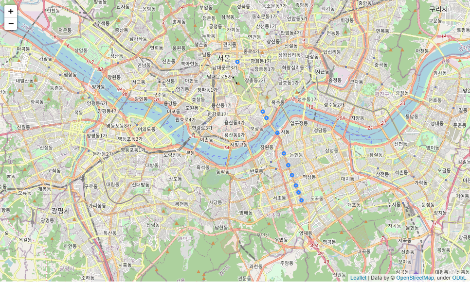
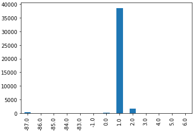
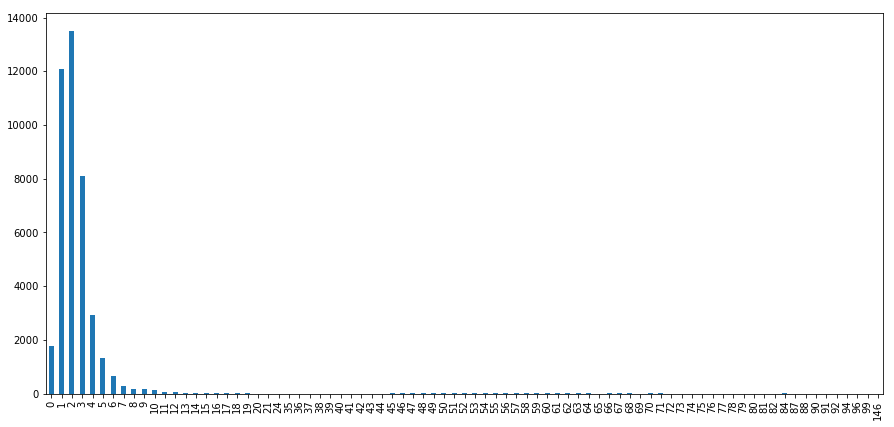
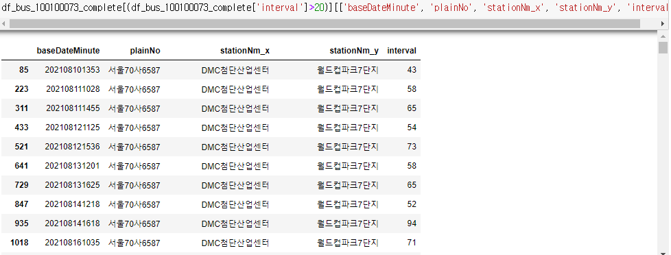

# Visualization

* 괄호안에는 우선순위를 뜻함

* 관찰 구간 정류장

  * 진관차고지행

    

  * 세곡동사거리행(강남)

    

* 시간별 버스 움직임 folium에 시각화(낮음)

* df_bus_100100073_shift의 seqDiff 나오는 빈도

  * -87, -86 등 이상한 값들이 몇 번 나왔는지 시각화

    

    

* interval의 분포

  

* interval이 높게 나온 장소

  * 10~20 사이의 데이터(정류장 사이의 거리가 긴 장소)

    

  * 극단적으로 높은 값들(종점에 도착하고 쉰다음 다시 출발하는 버스)

    

