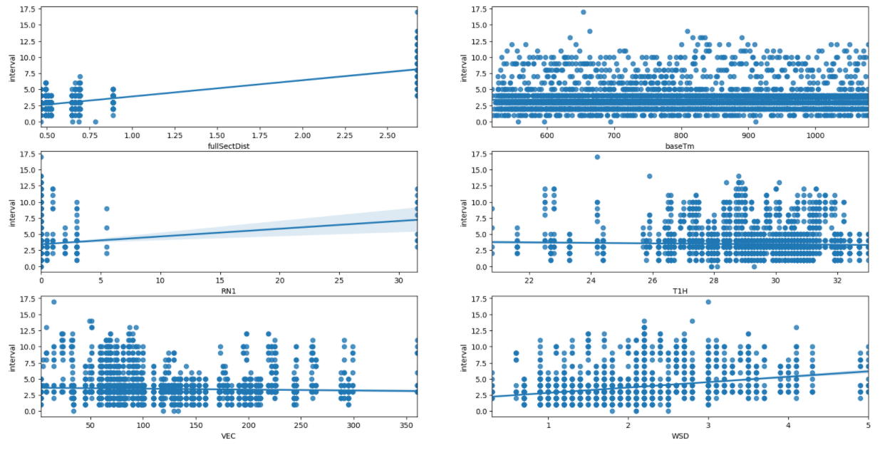
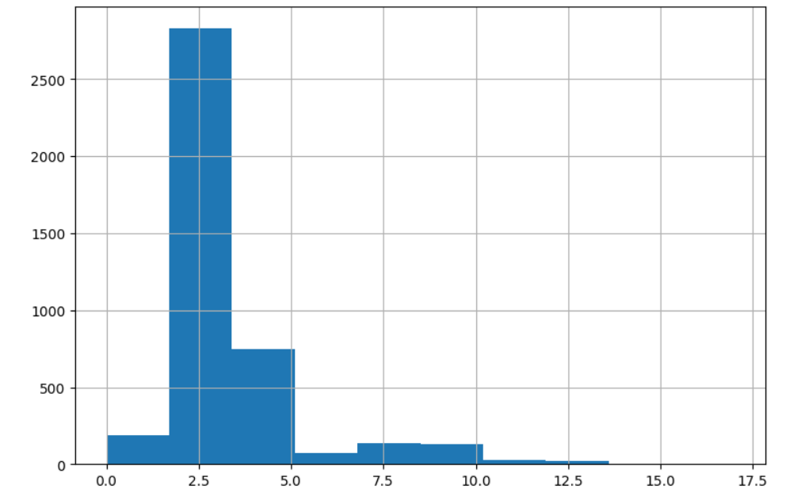
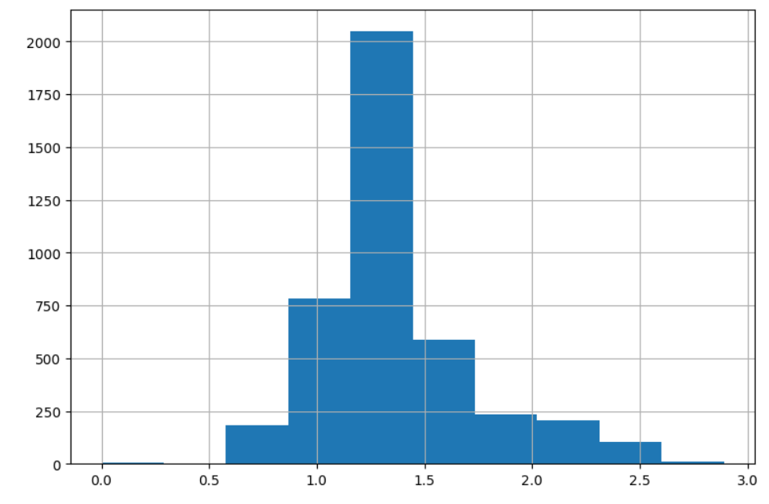
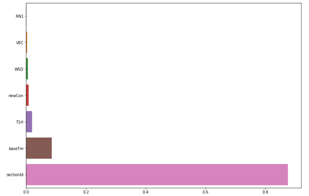

데이터 전처리 과정
- bus 실시간 위치 데이터 column 체크 후 아래만 선별

dataTm : 데이터 제공 시간
fullSectDist : 정류소간 거리
plainNo : 차량 번호
gpsX : 맵매칭X좌표 (WGS84)
gpsY : 맵매칭Y좌표 (WGS84)
nextStId : 다음정류소아이디
sectionId : 구간ID
stopFlag : 정류소 도착 여부 (0:운행중, 1:도착)
congetion : 혼잡도 (0 : 없음, 3 : 여유, 4 : 보통, 5 : 혼잡, 6 : 매우혼잡)

다음 정류소의 ID가 포함된 column이 있었으나, 결측치가 너무 많아서 다음 정류소 ID는 route 데이터로 추가하기로 결정.


   - bus route 데이터 가공과 column 선별

각 데이터에 출발/도착 정류장 정보를 추가: 출도착 정류장 이름, 번호, 좌표

```python
# 노선별 정류장 순서를 나타내는 seq 컬럼을 기준으로 startseq 생성
df_route_100100019['startseq']= df_route_100100019['seq']-1

# 필요한 정보만 포함한 복제 dataframe을 생성
df_route_100100019_ = df_route_100100019[['seq','station','stationNo','stationNm','gpsX','gpsY']]

# seq와 startseq를 기준으로 병합하여 출도착 정류장 이름, 번호, 좌표를 포함한 dataframe 생성
df_route_100100019 = pd.merge(df_route_100100019,df_route_100100019_, how='left', left_on='startseq', right_on='seq')
```

busRouteID : 버스 노선 ID
seq : 노선별 정류장 순서
station_x : 출발 정류장 번호
stationNm_x : 출발 정류장 이름
gpsX_x : 출발 정류장 맵매칭X좌표 (WGS84)
gpsY_x  : 출발 정류장 맵매칭Y좌표 (WGS84)
section : 구간ID
station_y : 도착 정류장 번호
stationNm_y : 도착 정류장 이름
gpsX_y : 도착 정류장 맵매칭X좌표 (WGS84)
gpsY_y  : 도착 정류장 맵매칭Y좌표 (WGS84)


- bus 실시간 위치 정보와 route정보 병합

```python
df_bus_100100019_merge = pd.merge(df_bus_100100019,df_route_100100019, how='left', left_on='sectionId', right_on='section')
```


- weather의 스키마를 기계학습을 위해 적절하게 변경

```python
# 카테고리의 unique value를 리스트로 생성
cates = df_weather['category'].unique().tolist()

# 'category'와'obsrValue'가 없는 dataframe 생성 후 중복값 제거
df_weather_ = df_weather[['baseDateTime','nx','ny']]
df_weather_=df_weather_.drop_duplicates()

# 복제된 dataframe과 원본 dataframe을 비교하며 필요한 정보 column들을 추가
df_weather_ = df_weather_.reset_index()
for cate in cates:
    df_weather_value = df_weather[df_weather['category']==cate]
    df_weather_value = df_weather_value.reset_index()
    df_weather_[cate] = df_weather_value['obsrValue'].where(df_weather_value['baseDateTime']==df_weather_['baseDateTime'], 'error')
```


bus와 weather 병합 후

- baseTm : 분으로만 시간을 표기한 column 생성
```python
  df_bus_100100073_weather['baseTm']= df_bus_100100073_weather['baseHr']*60 + df_bus_100100073_weather['baseMn']
```

- congetion :  혼잡도를 나타낸 숫자를 (0 : 없음, 3 : 여유, 4 : 보통, 5 : 혼잡, 6 : 매우혼잡) 아래와 같이 변경 (0 : 없음, 1 : 여유, 2 : 보통, 3 : 혼잡, 4 : 매우 혼잡)
```python
df_bus_100100073_weather['newCon'] = [x-2 if x> 2 else 0 for x in df_bus_100100073_weather['congetion']]
```

- weather 데이터의 결측치 확인 : 확인 결과 한 시간 동안의 모든 데이터가 결측치 -> 회의 후 모두 drop 하기로 결정
  - 오픈 API활용가이드에 따르면 '  +900이상, –900 이하 값은 **Missing 값으로 처리**  관측장비가 없는 해양 지역이거나 관측장비의 결측 등으로 자료가 없음을 의미  '
  - UUU, VVV 는 방향별 풍속을 나타내고, 다른 값들과 비교해보았을 때 -52.9는 결측치를 의미한다고 판단.


- 머신러닝

  - Linear Regression
```python
from sklearn.linear_model import LinearRegression
from sklearn.model_selection import train_test_split
from sklearn.metrics import mean_squared_error, r2_score
import numpy as np

X_train, X_test, y_train, y_test = train_test_split(df_bus_100100073_weather[['fullSectDist','baseTm','RN1','T1H','VEC','WSD','newCon']], df_bus_100100073_weather['interval'],test_size=0.3, random_state=0)

# 선형 회귀를 이용하여 학습 및 예측 수행. 
lr = LinearRegression()
lr.fit(X_train, y_train)
lr_preds = lr.predict(X_test)

lr_mse = mean_squared_error(y_test, lr_preds)
lr_rmse = np.sqrt(lr_mse)

print('MSE : {0: .3f}, RMSE : {0: .3f}' .format(lr_mse, lr_rmse))
print('Variance score : {0: .3f}' .format(r2_score(y_test, lr_preds)))
```
결과:   

```
MSE :  1.149, RMSE :  1.072
Variance score(R2 socre) :  0.695
```

각 feature가 회귀 결과에 미치는 영향이 어느 정도인지 시각화 (linear)

```python
import matplotlib.pyplot as plt
import seaborn as sns

plt.figure(figsize=(20,10))
plt.subplot(4,2,1)
sns.regplot(x='fullSectDist',y='interval', data= df_bus_100100073_weather)
plt.subplot(4,2,2)
sns.regplot(x='baseTm',y='interval', data= df_bus_100100073_weather)
plt.subplot(4,2,3)
sns.regplot(x='RN1',y='interval', data= df_bus_100100073_weather)
plt.subplot(4,2,4)
sns.regplot(x='T1H',y='interval', data= df_bus_100100073_weather)
plt.subplot(4,2,5)
sns.regplot(x='VEC',y='interval', data= df_bus_100100073_weather)
plt.subplot(4,2,6)
sns.regplot(x='WSD',y='interval', data= df_bus_100100073_weather)
plt.subplot(4,2,7)
sns.regplot(x='newCon',y='interval', data= df_bus_100100073_weather)
plt.show()
```




**상단에서 가장 연관성이 높아 보였던 fullsectdist, RN1, WSD 만 넣고 linear regression을 돌린 결과**

```python
X_train, X_test, y_train, y_test = train_test_split(df_bus_100100073_weather[['fullSectDist','WSD','RN1']], df_bus_100100073_weather['interval'],test_size=0.3, random_state=0)

# 선형 회귀를 이용하여 학습 및 예측 수행. 
lr = LinearRegression()
lr.fit(X_train, y_train)
lr_preds = lr.predict(X_test)

lr_mse = mean_squared_error(y_test, lr_preds)
lr_rmse = np.sqrt(lr_mse)

print('MSE : {: .3f}, RMSE : {: .3f}' .format(lr_mse, lr_rmse))
print('Variance score : {0: .3f}' .format(r2_score(y_test, lr_preds)))
```

결과:

```
MSE :  1.152, RMSE :  1.073
Variance score(R2 score) :  0.694
```

**타겟 정규화**






```python
X_train, X_test, y_train, y_test = train_test_split(df_bus_100100073_weather[['fullSectDist','WSD','RN1']], log_interval,test_size=0.3, random_state=0)

# 정규화 이후 선형 회귀를 이용하여 학습 및 예측 수행. 
lr = LinearRegression()
lr.fit(X_train, y_train)
lr_preds = lr.predict(X_test)

lr_mse = mean_squared_error(y_test, lr_preds)
lr_rmse = np.sqrt(lr_mse)

print('MSE : {: .3f}, RMSE : {: .3f}' .format(lr_mse, lr_rmse))
print('Variance score : {0: .3f}' .format(r2_score(y_test, lr_preds)))
```

결과:

```
MSE :  0.052, RMSE :  0.229
Variance score :  0.566
```


- Random Forest Regression

**정규화 하지 않은 target 으로 Random Forest를 돌렸을 경우:** 

```python
X_train, X_test, y_train, y_test = train_test_split(df_bus_100100073_weather[['sectionId','baseTm','RN1','T1H','VEC','WSD','newCon']], df_bus_100100073_weather['interval'],test_size=0.3, random_state=0)

from sklearn.ensemble import RandomForestRegressor
import pandas as pd
import warnings
warnings.filterwarnings('ignore')

rf_clf = RandomForestRegressor(random_state = 0)
rf_clf.fit(X_train, y_train)
rf_pred = rf_clf.predict(X_test)

rf_mse = mean_squared_error(y_test, rf_pred)
rf_rmse = np.sqrt(rf_mse)

print('MSE : {: .3f}, RMSE : {: .3f}' .format(rf_mse, rf_rmse))
print('Variance score : {0: .3f}' .format(r2_score(y_test, rf_pred)))
```

결과:

```
MSE :  1.098, RMSE :  1.048
Variance score :  0.709
```

**GridSearchCV를 사용하여 최적의 파라미터 탐색** (scoring은 MSE이용)

```python
from sklearn.model_selection import GridSearchCV

params = {'max_depth': [8, 10, 12],
 'min_samples_leaf': [1, 2, 4, 8],
 'min_samples_split': [2, 5, 10],
 'n_estimators': [50,100]}

rf_clf = RandomForestRegressor(random_state = 0, n_jobs = -1)
grid_cv = GridSearchCV(rf_clf, param_grid = params, scoring = mean_squared_error,cv = 2, n_jobs=-1)
grid_cv.fit(X_train, y_train)

print('최적 하이퍼 파라미터 : {0}' .format(grid_cv.best_params_))
```

결과:

```
최적 하이퍼 파라미터 : {'max_depth': 8, 'min_samples_leaf': 1, 'min_samples_split': 2, 'n_estimators': 50}
```

최적의 하이퍼 파라미터 적용 후:

```python
rf_clf1 = RandomForestRegressor(max_depth=8, min_samples_leaf=1, min_samples_split=2, n_estimators=50)

rf_clf1.fit(X_train,y_train)
rf1_pred = rf_clf1.predict(X_test)

rf1_mse = mean_squared_error(y_test, rf1_pred)
rf1_rmse = np.sqrt(rf1_mse)

print('MSE : {: .3f}, RMSE : {: .3f}' .format(rf1_mse, rf1_rmse))
print('Variance score : {0: .3f}' .format(r2_score(y_test, rf1_pred)))
```

결과:

```
MSE :  0.949, RMSE :  0.974
Variance score :  0.748
```


**정규화한 target 으로 Random Forest를 돌렸을 경우:**

```python
X_train, X_test, y_train, y_test = train_test_split(df_bus_100100073_weather[['sectionId','baseTm','RN1','T1H','VEC','WSD','newCon']],  log_interval,test_size=0.3, random_state=0)

from sklearn.ensemble import RandomForestRegressor
import pandas as pd
import warnings
warnings.filterwarnings('ignore')

rf_clf = RandomForestRegressor(random_state = 0)
rf_clf.fit(X_train, y_train)
rf_pred = rf_clf.predict(X_test)

rf_mse = mean_squared_error(y_test, rf_pred)
rf_rmse = np.sqrt(rf_mse)

print('MSE : {: .3f}, RMSE : {: .3f}' .format(rf_mse, rf_rmse))
print('Variance score : {0: .3f}' .format(r2_score(y_test, rf_pred)))
```

결과:

```
MSE :  0.059, RMSE :  0.243
Variance score :  0.509
```

**최적의 하이퍼 파라미터를 사용한 경우**

(코드는 상단의 경우와 같음)

결과:

```
MSE :  0.047, RMSE :  0.217
Variance score :  0.610
```

**가장 MSE가 낮았던 마지막 모델의 각 feature별 중요도를 시각화**

```python
rf_clf1.fit(X_train,y_train)

feature_series = pd.Series(data=rf_clf1.feature_importances_, index = X_train.columns)
feature_series = feature_series.sort_values(ascending=True)
plt.figure(figsize=(13,9))
bar = sns.barplot(x= feature_series, y = feature_series.index)
plt.show(bar)
```



