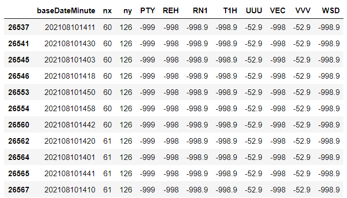

데이터 전처리 과정
- bus 실시간 위치 데이터 column 체크 후 아래만 선별

dataTm : 데이터 제공 시간
fullSectDist : 정류소간 거리
plainNo : 차량 번호
gpsX : 맵매칭X좌표 (WGS84)
gpsY : 맵매칭Y좌표 (WGS84)
nextStId : 다음정류소아이디
sectionId : 구간ID
stopFlag : 정류소 도착 여부 (0:운행중, 1:도착)
congetion : 혼잡도 (0 : 없음, 3 : 여유, 4 : 보통, 5 : 혼잡, 6 : 매우혼잡)

다음 정류소의 ID가 포함된 column이 있었으나, 결측치가 너무 많아서 다음 정류소 ID는 route 데이터로 추가하기로 결정.


   - bus route 데이터 가공과 column 선별

각 데이터에 출발/도착 정류장 정보를 추가: 출도착 정류장 이름, 번호, 좌표

```python
# 노선별 정류장 순서를 나타내는 seq 컬럼을 기준으로 startseq 생성
df_route_100100019['startseq']= df_route_100100019['seq']-1

# 필요한 정보만 포함한 복제 dataframe을 생성
df_route_100100019_ = df_route_100100019[['seq','station','stationNo','stationNm','gpsX','gpsY']]

# seq와 startseq를 기준으로 병합하여 출도착 정류장 이름, 번호, 좌표를 포함한 dataframe 생성
df_route_100100019 = pd.merge(df_route_100100019,df_route_100100019_, how='left', left_on='startseq', right_on='seq')
```

busRouteID : 버스 노선 ID
seq : 노선별 정류장 순서
station_x : 출발 정류장 번호
stationNm_x : 출발 정류장 이름
gpsX_x : 출발 정류장 맵매칭X좌표 (WGS84)
gpsY_x  : 출발 정류장 맵매칭Y좌표 (WGS84)
section : 구간ID
station_y : 도착 정류장 번호
stationNm_y : 도착 정류장 이름
gpsX_y : 도착 정류장 맵매칭X좌표 (WGS84)
gpsY_y  : 도착 정류장 맵매칭Y좌표 (WGS84)


- bus 실시간 위치 정보와 route정보 병합

```python
df_bus_100100019_merge = pd.merge(df_bus_100100019,df_route_100100019, how='left', left_on='sectionId', right_on='section')
```


- weather의 스키마를 기계학습을 위해 적절하게 변경

```python
# 카테고리의 unique value를 리스트로 생성
cates = df_weather['category'].unique().tolist()

# 'category'와'obsrValue'가 없는 dataframe 생성 후 중복값 제거
df_weather_ = df_weather[['baseDateTime','nx','ny']]
df_weather_=df_weather_.drop_duplicates()

# 복제된 dataframe과 원본 dataframe을 비교하며 필요한 정보 column들을 추가
df_weather_ = df_weather_.reset_index()
for cate in cates:
    df_weather_value = df_weather[df_weather['category']==cate]
    df_weather_value = df_weather_value.reset_index()
    df_weather_[cate] = df_weather_value['obsrValue'].where(df_weather_value['baseDateTime']==df_weather_['baseDateTime'], 'error')
```


bus와 weather 병합 후

- baseTm : 분으로만 시간을 표기한 column 생성
```python
  df_bus_100100073_weather['baseTm']= df_bus_100100073_weather['baseHr']*60 + df_bus_100100073_weather['baseMn']
```

- congetion :  혼잡도를 나타낸 숫자를 (0 : 없음, 3 : 여유, 4 : 보통, 5 : 혼잡, 6 : 매우혼잡) 아래와 같이 변경 (0 : 없음, 1 : 여유, 2 : 보통, 3 : 혼잡, 4 : 매우 혼잡)
```python
df_bus_100100073_weather['newCon'] = [x-2 if x> 2 else 0 for x in df_bus_100100073_weather['congetion']]
```

- weather 데이터의 결측치 확인 : 확인 결과 한 시간 동안의 모든 데이터가 결측치 -> 회의 후 모두 drop 하기로 결정
  - 오픈 API활용가이드에 따르면 '  +900이상, –900 이하 값은 **Missing 값으로 처리**  관측장비가 없는 해양 지역이거나 관측장비의 결측 등으로 자료가 없음을 의미  '
  - UUU, VVV 는 방향별 풍속을 나타내고, 다른 값들과 비교해보았을 때 -52.9는 결측치를 의미한다고 판단.




그 외: 

 - 교통정보부에 문의하여 데이터 관련 궁금한 점 문의: 전화, 메일 

    - eg) 데이터 수집 방식: 버스내 설치된 차량단말기에 LTE 모뎀을 설치하여 이를 통하여 버스의 운행정보를 수집합니다. 차량단말기에서 2가지의 이벤트 정보를 수집.

      ​     \- 첫번째는 정주기 보고로 버스의 위치와 관계없이 10초 단위로 자신의 위치를 센터로 전송

      ​     \- 두번째는 버스가 정류소에 도착 및 출발할 때로, 이는 정류소에 도착 및 출발할때 이벤트 정보를 센터로 전송함

   - 각 column의 정확한 의미

 - 소요 시간 계산 개선사항 건의

    - sectionId가 도착과 동시에 (stopFlag가 바뀜과 동시에) 변경이 되므로 그 순간을 출발 시간으로 지정해서, 도착하였을 때 승객이 내리고 타는 시간 또한 다음 역까지 가는 데에 소요시간으로 포함 => 이전 방법(출도착 시간을 따로 찾아서 등록)에 비해 row 수를 절반으로 줄일 수 있고, 소요시간 계산을 간단하게 할 수 있음

- 머신러닝 feature 건의

  - weather 데이터의 category와 obsrValue를 조합하여 각 column을 만들기로 건의
  - 그렇게 파생된 columns 중 RN1(강수량)이 PTY(비 유무)를 포함하고 있으니 drop 건의, VVV UUU(방향별 풍속), WSD(풍속), VEC(방향)들은 겹치기도 하고 버스 소요시간에 큰 영향을 주지 않을 것이니 drop 건의


개발 후기 및 느낀점 : 

